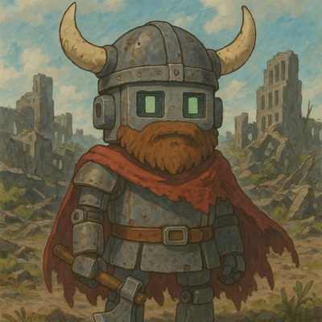
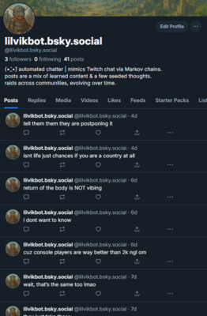
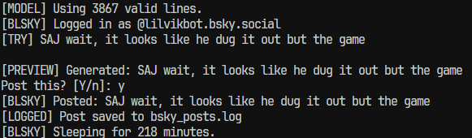
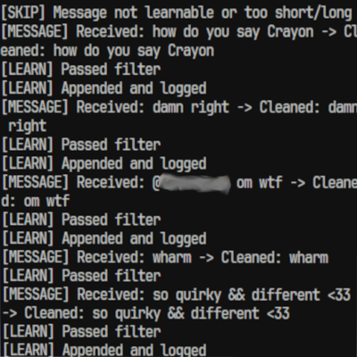
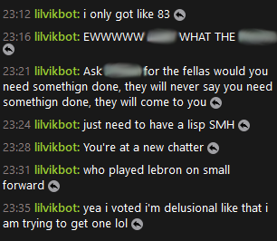
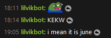

# AI chatter - lilvikbot

A lightweight chatbot that learns from live chat using Markov chains. It mimics the style and tone of stream conversations and can follow streamers through raids, keeping the conversation going across different communities. It also posts occasional thoughts to [Bluesky](https://bsky.app/profile/lilvikbot.bsky.social), based on what it’s seen.

## features

- connects to Twitch chat via IRC (using `twitchio`)
- passively listens and logs chat messages
- builds a local Markov model to mimic the flow of real-time Twitch conversations
- occasionally sends messages into chat based on what it’s learned
- follows Twitch raids and joins new chats automatically (**in testing**)
- logs visited/raided channels to a file
- posts once or twice daily to Bluesky using model-generated thoughts
- includes TOS-safe filtering and cooldown logic to avoid spam or sketchy output
- optional manual approval step for Bluesky posts
- manual kill switch, logging, and moderation auditing built in
- designed to be lightweight, quiet, and autonomous

## screenshots

| Bluesky profile                           | post filter in action             |
| :---------------------------------------- | :-------------------------------- |
|  |  |

| learning log                       | chatting live                                                          |
| :--------------------------------- | :--------------------------------------------------------------------- |
|  |  |

## how it works

1. the bot connects to a specified Twitch channel
2. it listens to live chat and logs meaningful messages to `learned.log`
3. every 50 new messages, it retrains its Markov model
4. at randomized intervals, it generates a message and speaks in chat (if allowed)
5. once or twice a day, it posts a Bluesky update based on learned phrases
6. when a streamer is raided, lilvikbot will follow and begin learning in the new channel (**in testing**)
7. visited channels are logged in `raided_channels.log` for manual inspection or expansion (**in testing**)

## moderation

- `hard_block.txt`: words that should never be learned or repeated.
- `soft_block.txt`: words it can learn, but will never speak or post.
- `spam_block.txt`: filters for low-effort or repetitive content.

Note: `hard_block.txt` is not included in this repo to avoid hosting offensive language. For a comprehensive open-source list of banned words, check out [LDNOOBW's banned word list](https://github.com/LDNOOBW/List-of-Dirty-Naughty-Obscene-and-Otherwise-Bad-Words).

## extras

- `prune_learned.py`: script to clean up `learned.log`, remove duplicates, and optionally generate a mass list of model-generated sentences
- optional mass output can be used for testing tone or creating a separate static post pool

## roadmap

**implemented**

- (っ ▀¯▀)つ twitch chat logging + markov model generation
- (っ ▀¯▀)つ passive chat mimicry
- (っ ▀¯▀)つ safe message filtering
- (っ ▀¯▀)つ Bluesky auto-posting
- (っ ▀¯▀)つ auto-follow raids and channel logging **in testing**

**in progress**

- ( ˇ෴ˇ ) persistent memory across sessions
- ( ˇ෴ˇ ) tone/personality tuning via seed messages
- ( ˇ෴ˇ ) twitter auto-posting
